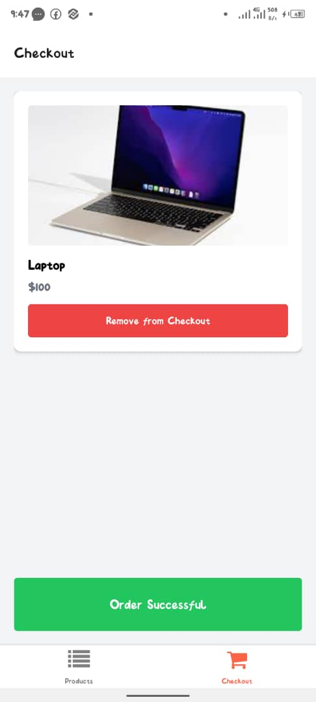
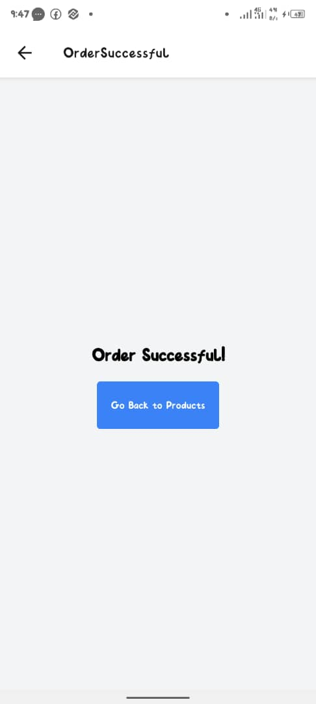

# Simple Shopping App

## Overview
This is a simple shopping app built with React Native and Expo. It allows users to view a list of products, add products to a checkout list, and navigate to an order successful screen.

## Features
- View a list of products
- Add products to the checkout list
- Remove products from the checkout list
- Navigate to an order successful screen

## Screenshots

## Setup Instructions

### Prerequisites
- Node.js
- npm or yarn
- Expo CLI (`npm install -g expo-cli`)

### Clone the Repository
git clone https://github.com/Hardeezah/e-shop.git
cd e-shop

### Install dependencies
npm install
or
yarn install

### Run the app
expo start

### App download link
https://expo.dev/artifacts/eas/nbD3SJXY7iW3gYLge7rkRW.apk

